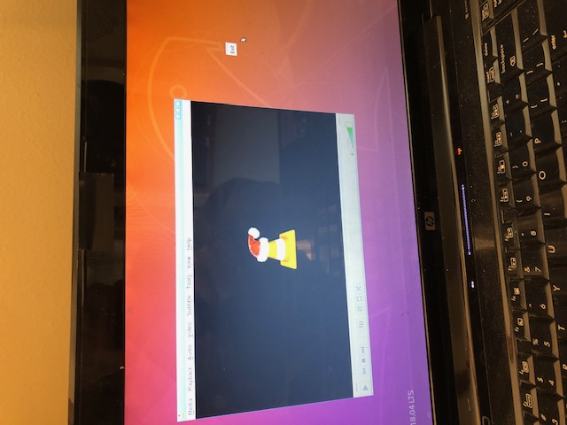

# ubukiosk
Sample files for setting up kiosk mode for a user to run VLC video player on UBU 18.0.4

## Install Dependencies
```
sudo apt update
sudo apt install openbox
sudo apt install vlc
```

## Create new user
Here we are creating a new user called "wo" with a password of "password", but insert your own user name and password if different.
```
sudo adduser wo --gecos "" --disabled-password
echo "wo:password" | sudo chpasswd
```
## Copy the repo's home/wo files to new user's home directory
1. Copy the repo's `home/wo/.dmrc` file to your new user's `/home/yourNewUser/.dmrc`.  This file tells Ubuntu's `lampdm` to use `openbox` as a window manager.  This limits what the new user has access to when they log in.
2. Copy the repo's `home/wo/.config` dir and contents to your new user's `/home/yourNewUser/.config` directory.  These files limit what is available to the new user: basically the VLC app runs and when the user closes the app, the system will shutdown or log out the user.  It also prevents the nag screen about Ubuntu updates from popping up and limits the right mouse click to just an "Exit" option, preventing the user from accessing other pop-up apps that are otherwise available via openbox.
3. Ensure that all the copied files are set yourNewUser:

```
sudo chown -R yourNewUser:yourNewUser /home/yourNewUser/.dmrc
sudo chown -R yourNewUser:yourNewUser /home/yourNewUser/.config
```
## Sample Screenshot
When you login as the new user, you should see something like this, where VLC is running and no other apps are  visible.  Note that in the figure, on the right side, there is a tiny little blob that looks like a lttle white chicklet-- this is what appears when the user tries clicking the right mouse button out on the desktop.  The above .config/openbox files cut down the openbox options to just the Exit option.

